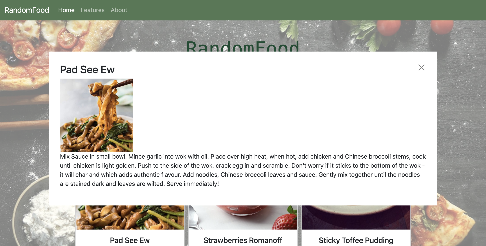

# RandomFood
Don't know what to eat? Use 'RandomFood' to generate three meals for you today!

## requirments from Codecademy
+ To make your program truly random, the message that it outputs should be made up of at least three different pieces of data.
+ Build a message generator program using JavaScript
+ Use Git version control
+ Use command line
+ Develop locally on your computer

## Technologies used in the project
+ Html
+ Css
+ Javascript
+ Bootstrap
+ Git

## Detailed requirments
1. Homepage that allows users to generate three measl
2. After clicking the button, three dishes will be generated along with their recipes.
3. Allow users to check further detail of each dish

## Recipe api used in the app

[TheMealDB](https://www.themealdb.com/)

## Screenshot of the project

### Main page 

### Check detail of the recipe

## Existing bugs that could be addressed in the future
1. When the recipe texts are too long, the check detail modal could cover the whole page and prevent users from interacting well
